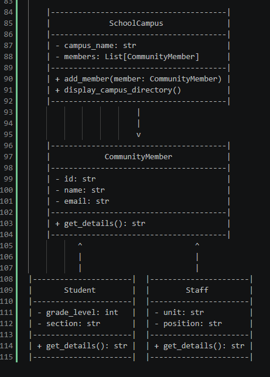
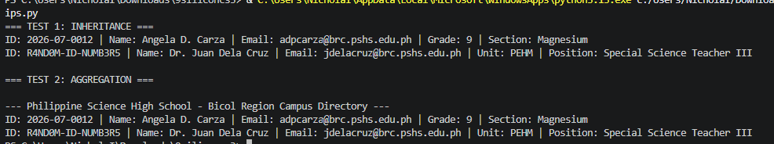
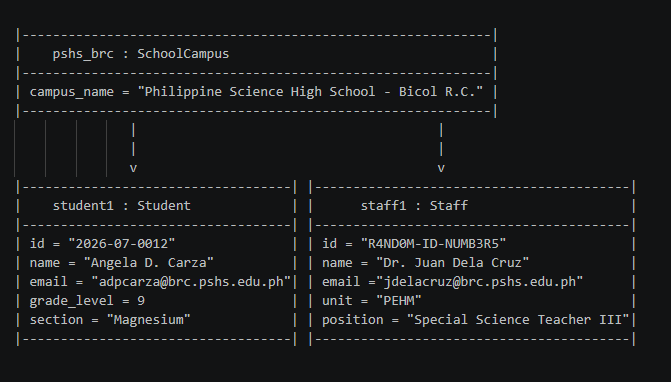

# Advanced Class Relationships

## Previous Activities
[classAttrib](classAttributesMethods.md)
[classRel](classRelationships.md)

## Existing System Description:
The system models the organizational structure of Philippine Science High School - Bicol Region Campus (PSHS-BRC). It manages campus entity registrations, including students and staff members who participate in academic and institutional activities.

## Inheritance Relationship
Parent: CommunityMember
Child: Staff and Students
Explanation: Both Student and Staff represent individual people in the campus system with shared general attributes (ID, name, and email). They are specific types of community members, satisfying the IS-A relationship requirement.

## Inheritance UML

## Composition/Aggregation
Relationship: Aggregation
Explanation: The SchoolCampus class holds a collection of CommunityMember objects (Students and Staff). This is Aggregation (weak HAS-A) because students and staff exist as independent objects before being added to the campus directory, and their lifecycles are not strictly bound to the deletion of the campus object.

## Advanced UML Diagram

## Python Implementation
[Source Code](advancedRelationships.py)

## Test Run

## Object Diagram

## Reflection
Answers:

1. Why did you choose your inheritance relationship? Explain why your child class is a type of your parent class.
I chose 'CommunityMember' as the parent class and 'Student' (as well as 'Staff') as child classes because every student and staff member fundamentally IS-A member of the school community. They share baseline attributes like 'id', 'name', and 'email', but each child class extends this foundation with specialized properties like 'grade_level' or 'unit'.

2. How did inheritance reduce duplicate code? Identify attributes or methods that were reused.
Inheritance eliminated the need to redefine common individual attributes ('id', 'name', 'email') in every specific role class. Additionally, the 'get_details()' method in 'CommunityMember' handles formatting general information, allowing child classes to simply call 'super().get_details()' and append their specialized attributes without duplicating string formatting logic.

3. Why is your HAS-A relationship Composition or Aggregation? Explain the lifecycle relationship between the two objects.
The relationship between 'SchoolCampus' and 'CommunityMember' is Aggregation because member objects are instantiated independently outside of the 'SchoolCampus' instance and then passed into it. If the 'SchoolCampus' instance is destroyed or cleared, the underlying 'Student' and 'Staff' objects still exist independently in memory.

4. What is the difference between Association from Part III and the advanced relationship you implemented?
Simple Association represents a general link where two classes interact without structural hierarchy or lifecycle dependence. In contrast, the advanced relationships add clear architectural rules: Inheritance defines an explicit type hierarchy (IS-A), while Aggregation specifies a container-to-content ownership model (HAS-A) with distinct object lifecycles.

5. How does your design follow the DRY principle?
The design adheres to the DRY (Don't Repeat Yourself) principle by centralizing shared attributes and behaviors inside the 'CommunityMember' superclass. Furthermore, through 'super().__init__()', child constructors reuse initialization code rather than rewriting assignment logic, making future system modifications far easier to manage in one central place.

    |---------------------------------------|
    |             SchoolCampus              |
    |---------------------------------------|
    | - campus_name: str                    |
    | - members: List[CommunityMember]      |
    |---------------------------------------|
    | + add_member(member: CommunityMember) |
    | + display_campus_directory()          |
    |---------------------------------------|
                        |
                        | 
                        v
    |---------------------------------------|
    |            CommunityMember            |
    |---------------------------------------|
    | - id: str                             |
    | - name: str                           |
    | - email: str                          |
    |---------------------------------------|
    | + get_details(): str                  |
    |---------------------------------------|
           ^                         ^
           |                         |
           |                         |
|----------------------|  |----------------------|
|       Student        |  |        Staff         |
|----------------------|  |----------------------|
| - grade_level: int   |  | - unit: str          |
| - section: str       |  | - position: str      |
|----------------------|  |----------------------|
| + get_details(): str |  | + get_details(): str |
|----------------------|  |----------------------|

|-------------------------------------------------------------|
|    pshs_brc : SchoolCampus                                  |
|-------------------------------------------------------------|
| campus_name = "Philippine Science High School - Bicol R.C." |
|-------------------------------------------------------------|
               |                                       |
               |                                       |
               v                                       v
|-----------------------------------| |-----------------------------------------|
|    student1 : Student             | |      staff1 : Staff                     |
|-----------------------------------| |-----------------------------------------|
| id = "2026-07-0012"               | | id = "R4ND0M-ID-NUMB3R5"                |
| name = "Angela D. Carza"          | | name = "Dr. Juan Dela Cruz"             |
| email = "adpcarza@brc.pshs.edu.ph"| | email ="jdelacruz@brc.pshs.edu.ph"      |
| grade_level = 9                   | | unit = "PEHM"                           |
| section = "Magnesium"             | | position = "Special Science Teacher III"|
|-----------------------------------| |-----------------------------------------|