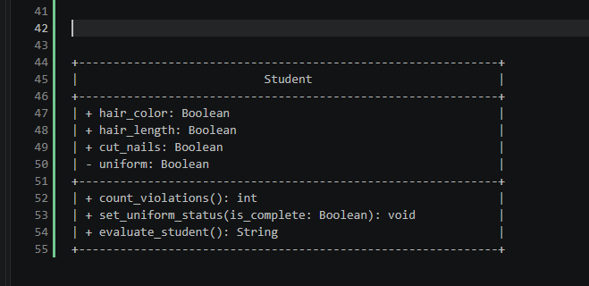
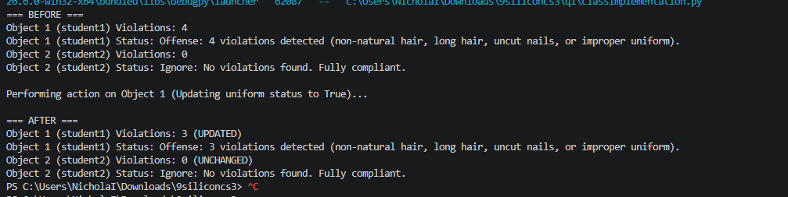
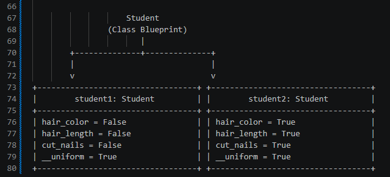

# Class Attributes and Methods

## Previous Design
Link to my previous activity:
[classObjectUML.md](q1/classObjectUML.md)

## Design Revision
- Renamed property names to standard Python snake_case naming conventions ('hair_color', 'hair_length', 'cut_nails', 'uniform').

## Visibility Decisions
| Attribute | Data Type | Visibility |               Reason              |
|-----------|-----------|------------|-----------------------------------|
|hair_color |  Boolean  |   Public   |Easily observable trait            |
|hair_length|  Boolean  |   Public   |Easily observable trait            |
|cut_nails  |  Boolean  |   Public   |Easily observable trait            |
|__uniform  |  Boolean  |  Private   |Depends on the school's policy/ies |

## Updated UML Class Diagram

## Python Implementation
[View Python Source](classImplementation.py)

## Test Run

## Object Diagram

## Analysis
### Why did you make your chosen attribute private?
- The 'uniform' attribute was made private ('__uniform') because uniform compliance status should only be updated through formal inspection logic rather than arbitrary direct assignment. If external code directly assigned 'student.__uniform = True', it could bypass validation rules or clear non-compliant status without verification. Making it private ensures data integrity by requiring updates to pass through dedicated methods like 'set_uniform_status()'.

### Which method changes the state of your object?
- The 'set_uniform_status()' method changes the internal state of the 'Student' object by accepting a boolean parameter ('is_complete') and reassigning the private '__uniform' attribute. When executed on 'student1', it modified its private field from 'False' to 'True'. As a result, 'student1's total violation count dropped from 4 to 3, directly altering its evaluated status output.

### How did your two objects demonstrate that instances are independent?
- Instance independence was demonstrated because calling 'set_uniform_status(True)' on 'student1' updated its specific attribute state without altering 'student2' in any way. 'student1' changed from 4 violations to 3 violations, whereas 'student2' retained its separate initial values (0 violations and "Ignore" status) continuously throughout the test execution.

### What is the difference between your class diagram and your object diagram?
- The class diagram acts as a static blueprint defining the generic structure of the 'Student' class, detailing property types, visibility symbols (+/-), and method signatures. On the other hand, the object diagram captures a dynamic snapshot of memory at runtime, illustrating concrete instantiated objects ('student1' and 'student2') along with the exact values held by their fields after method execution.

|-------------------------------------------------------------|
|                           Student                           |
|-------------------------------------------------------------|
| | hair_color: Boolean                                       |
| | hair_length: Boolean                                      |
| | cut_nails: Boolean                                        |
| - uniform: Boolean                                          |
|-------------------------------------------------------------|
| | count_violations(): int                                   |
| | set_uniform_status(is_complete: Boolean): void            |
| | evaluate_student(): String                                |
|-------------------------------------------------------------|

                    Student
                (Class Blueprint)
                       |
        |--------------|--------------|
        |                             |
        v                             v
|----------------------------------| |----------------------------------|
|        student1: Student         | |        student2: Student         |
|----------------------------------| |----------------------------------|
| hair_color = False               | | hair_color = True                |
| hair_length = False              | | hair_length = True               |
| cut_nails = False                | | cut_nails = True                 |
| __uniform = True                 | | __uniform = True                 |
|----------------------------------| |----------------------------------|