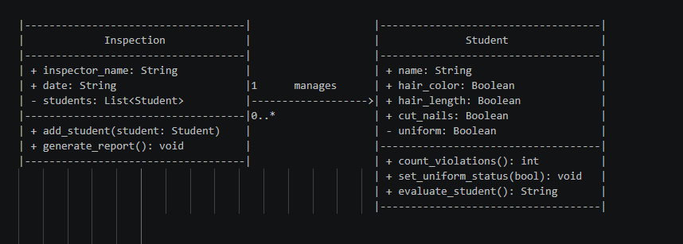
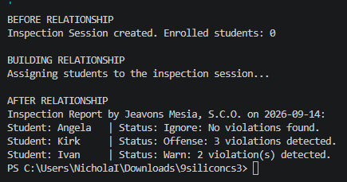
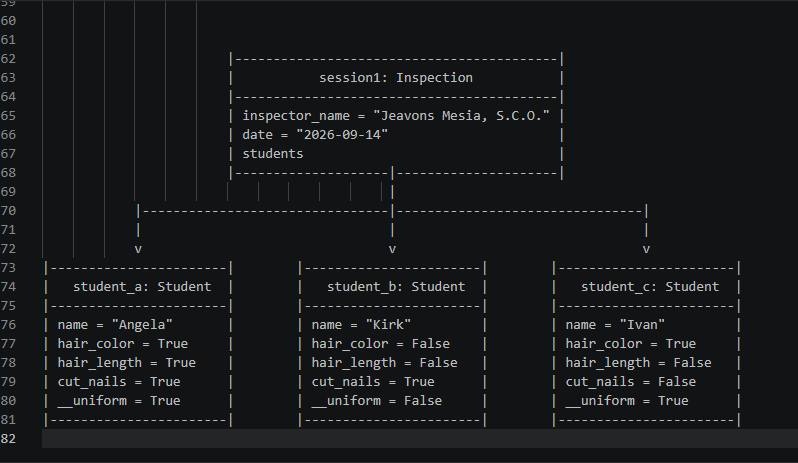

# Class Relationships: Association and Multiplicity
## Previous Work
[Part I - Classes and Objects](classObjectUML.md)
[Part II - Class Attributes and Methods](classAttributesMethods.md)

## Existing Class
Class: Student
Description: Represents individual students subject to grooming and dress code infractions (hair color, hair length, cut nails, and uniform compliance).

## New Related Class
Class: Inspection
Description: Represents a formal dress code verification session conducted on a specific date by an inspector to evaluate multiple student compliance states.

## Association
Relationship: 1 to 0..*
Explanation: Exactly one 'Inspection' session can manage zero or more ('0..*') 'Student' instances. An inspection session can exist before students arrive (0), but a list allows it to contain many students simultaneously.

## Multiplicity
Multiplicity: Inspection HAS-A / manages Students
Explanation: An 'Inspection' object manages and evaluates multiple 'Student' instances by collecting their actual object references in a list and triggering their evaluation methods.

## UML Class Relationship Diagram

## Python Implementation
[View Python Source](classRelationships.py)
## Test Run

## Object Relationship Diagram

## Analysis
### What is the association between your two classes?
- The association between 'Inspection' and 'Student' is a directed HAS-A relationship where an 'Inspection' object manages a collection of 'Student' objects. In my system, an inspection session gathers students together to audit their dress code compliance. The 'Inspection' class holds references to 'Student' instances and queries their internal state to generate an aggregated compliance report.

### What multiplicity did you choose and why?
- I chose a 1 to 0..* (one-to-many) multiplicity. This is appropriate because a single inspection session is conducted by one inspector on a given date, but it can assess zero students (when empty) or many students (0..*) during a typical school day. Defining the relationship as one-to-many reflects real-world group inspection procedures.

### How did you implement the relationship in Python?
- I implemented the relationship in Python by declaring a 'self.students' list inside the '__init__' constructor of the 'Inspection' class. The relationship is populated using the 'add_student(self, student)' method, which appends actual 'Student' object instances directly into the 'self.students' list.

### Why did you store an object reference instead of copying its data?
- Storing an object reference ensures that the 'Inspection' session interacts directly with the live 'Student' object rather than a static duplicate. For instance, if 'student_b.set_uniform_status(True)' is executed later, 'session1.generate_report()' instantly reads the updated state because both point to the exact same place in memory. Copying raw string data would cause stale, disconnected records.

### If your relationship uses many, why is a list appropriate?
- A Python list is appropriate for a "many" relationship because it provides a dynamic, ordered collection capable of holding an arbitrary number of object memory references. The list allows 'Inspection' to dynamically grow via '.append()' as more students enter the check, and enables clean iteration ('for student in self.students:') to execute methods across all connected objects.

|------------------------------------|                    |------------------------------------|
|             Inspection             |                    |              Student               |
|------------------------------------|                    |------------------------------------|
| + inspector_name: String           |                    | + name: String                     |
| + date: String                     |1      manages      | + hair_color: Boolean              |
| - students: List<Student>          |------------------->| + hair_length: Boolean             |
|------------------------------------|0..*                | + cut_nails: Boolean               |
| + add_student(student: Student)    |                    | - uniform: Boolean                 |
| + generate_report(): void          |                    |------------------------------------|
|------------------------------------|                    | + count_violations(): int          |
                                                          | + set_uniform_status(bool): void   |
                                                          | + evaluate_student(): String       |
                                                          |------------------------------------|

                        |------------------------------------------|
                        |           session1: Inspection           |
                        |------------------------------------------|
                        | inspector_name = "Jeavons Mesia, S.C.O." |
                        | date = "2026-09-14"                      |
                        | students                                 |
                        |--------------------|---------------------|
                                             |
            |--------------------------------|--------------------------------|
            |                                |                                |
            v                                v                                v
|-----------------------|        |-----------------------|        |-----------------------|
|   student_a: Student  |        |   student_b: Student  |        |   student_c: Student  |
|-----------------------|        |-----------------------|        |-----------------------|
| name = "Angela"       |        | name = "Kirk"         |        | name = "Ivan"         |
| hair_color = True     |        | hair_color = False    |        | hair_color = True     |
| hair_length = True    |        | hair_length = False   |        | hair_length = False   |
| cut_nails = True      |        | cut_nails = True      |        | cut_nails = False     |
| __uniform = True      |        | __uniform = False     |        | __uniform = True      |
|-----------------------|        |-----------------------|        |-----------------------|
